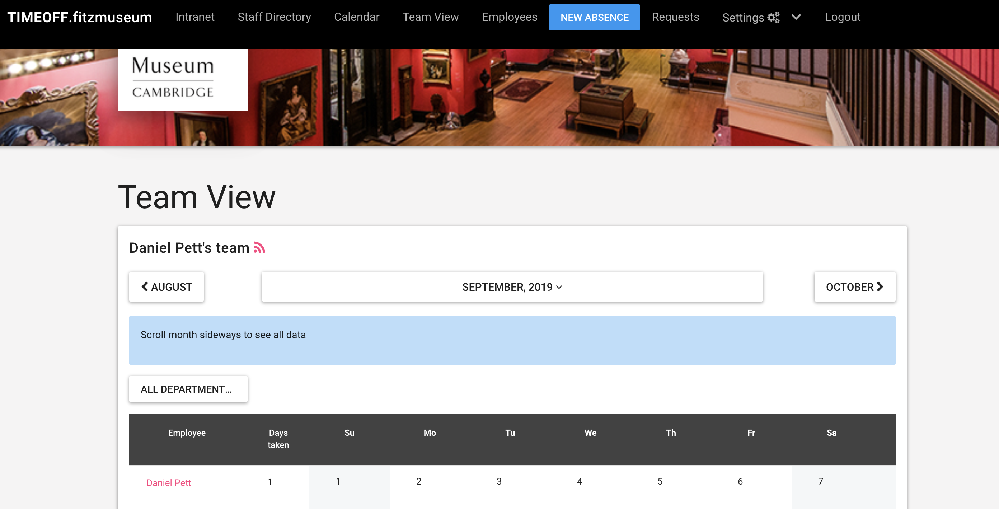
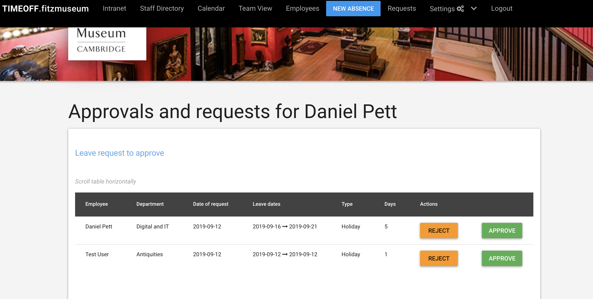
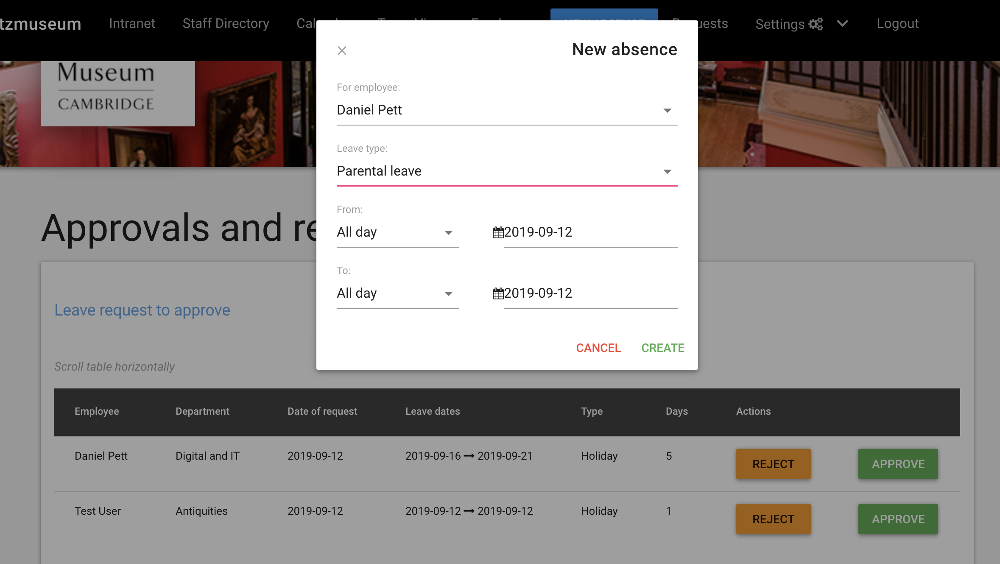

# Fitzwilliam Museum Annual Leave management

Web application for managing employee absence from work. This is adapted from
Timeoff.management

The theme on this version is customised to fit into the Fitzwilliam Museum's
suite of tools. It uses [daemonite](http://daemonite.github.io/material) and
Bootstrap 4 to skin and has rejigged code.

This produce will be owned by the Human Resources team, supported by the Digital
and IT team.

## Features

**Multiple views of staff absences**

Calendar view, Team view, or Just plain list.

**Tune application to fit into your company policy**

Add custom absence types: Sickness, Maternity, Working from home, Birthday etc.
Define if each uses vacation allowance.

Optionally limit the amount of days employees can take for each Leave type. E.g.
no more than 10 Sick days per year.

Setup public holidays as well as company specific days off.

Group employees by departments: bring your organisational structure, set the
supervisor for every department.

Customisable working schedule for company and individuals.

**Third Party Calendar Integration**

Broadcast employee whereabouts into external calendar providers: MS Outlook, G
oogle Calendar, and iCal.

Create calendar feeds for individuals, departments or entire company.

**Three Steps Workflow**

Employee requests time off or revokes existing one.

Supervisor gets email notification and decides about upcoming employee absence.

Absence is accounted. Peers are informed via team view or calendar feeds.

**Access control**

There are following types of users: employees, supervisors, and administrators.

Optional LDAP authentication: configure application to use your LDAP server for
user authentication.

**Seamless data migration betweeen different installations**

User friendly and simple workflow for data migration between different
TimeOff.Management installations.

Admin user can download the entire company data as a single JSON file and then
restore the account at a different installation by simply uploading the JSON.

**Works on mobile phones**

The most used customer paths are mobile friendly:

* employee is able to request new leave from mobile device

* supervisor is able to record decision from the mobile as well.

**Lots of other little things that would make life easier**

Manually adjust employee allowances
e.g. employee has extra day in lieu.

Upon creation employee receives pro-rated vacation allowance, depending on start
date.

Email notification to all involved parties.

Optionally allow employees to see the time off information of entire company
regardless of department structure.


### Self hosting

Install TimeOff.Management application within your infrastructure:

(make sure you have Node.js (>=4.0.0) and SQLite installed)

```bash
git clone https://github.com/timeoff-management/application.git timeoff-management
cd timeoff-management
cp db.json.dist db.json
cp app.json.dist app.json
```
Edit the config files for values associated with your mail provider and db config. 

```bash
npm install https://github.com/mapbox/node-sqlite3/tarball/master
npm install
npm start
```
Open http://localhost:3000/ in your browser.

Once up and running, you will need to create a new company and then bulk import
users from a csv file.

## Run tests

We have quite a wide test coverage, to make sure that the main user paths work as expected.

Please run them frequently while developing the project.

(make sure you have [PhantomJS](http://phantomjs.org/download.html) installed in path)

```bash
npm test
```

(make sure that application with default settings is up and running)

Any bug fixes or enhancements should have good test coverage to get them into "master" branch.

## Updating existing instance with new code

In case one needs to patch existing instance of TimeOff.Managenent application with new version:

```bash
git fetch
git pull origin master
npm install
npm run-script db-update
npm start
```

## Screenshots

Below are a few screenshots of how this app will present.

### Team view

### Approval of requests view

### Request leave modal

